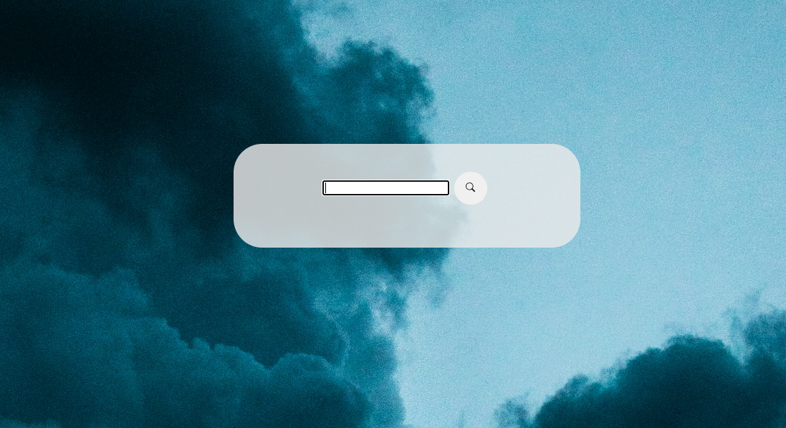

# 06-Challenge-weather-app

## Description
This application allows the user to input any city to search for the current weather conditions. 

## Table of Contents
- [Installation](#installation)
- [Usage](#usage)
- [Contributing](#contributing)
- [Questions](#questions)
- [Visuals](#visuals)

## Installation

This is run in the browser

## Usage

I used a third party API to pull in the data

## Contributing

[Michael Montoya](https://github.com/mmontoya1112)

## Credits

[OpenWeather One Call API](https://openweathermap.org/api/one-call-api)

## Questions

[github](https://github.com/krsparks2)
 
[email](mailto:krsparks2@yahoo.com)

## Visuals

Link to deployed application:
[Weather Dashboard](https://krsparks2.github.io/06-Challenge-weather-app/)

Screenshot of application: 

